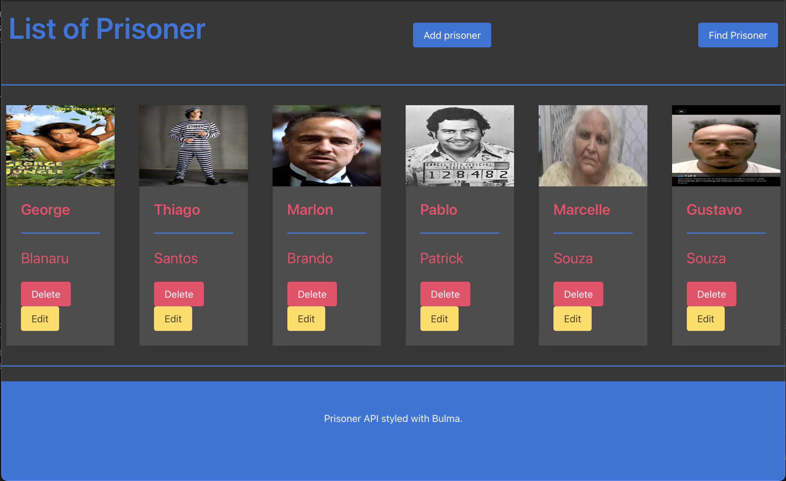
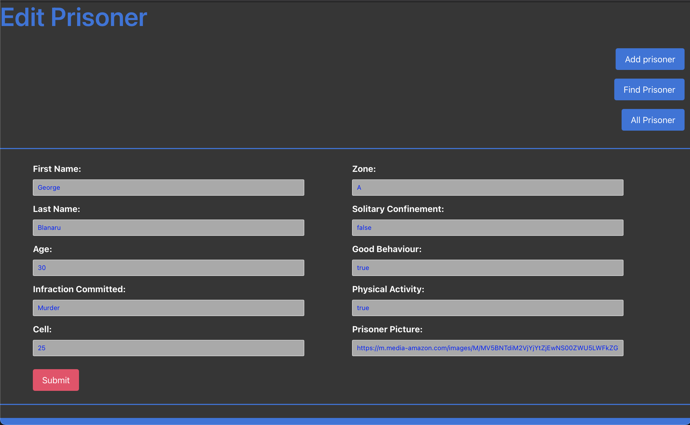
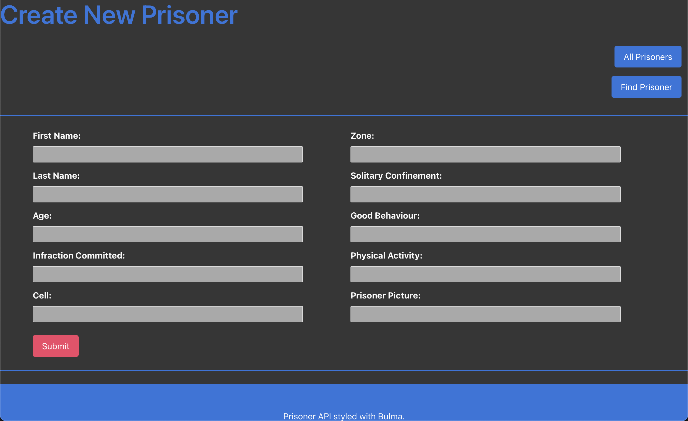
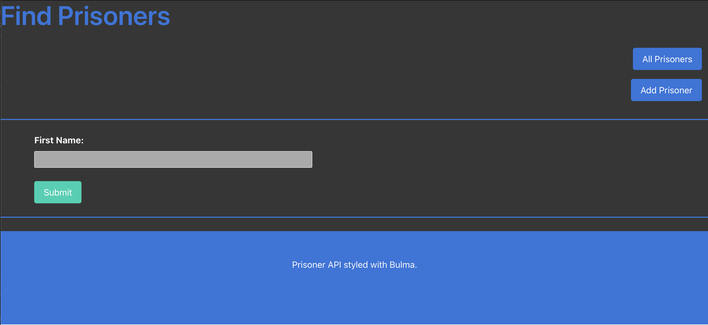
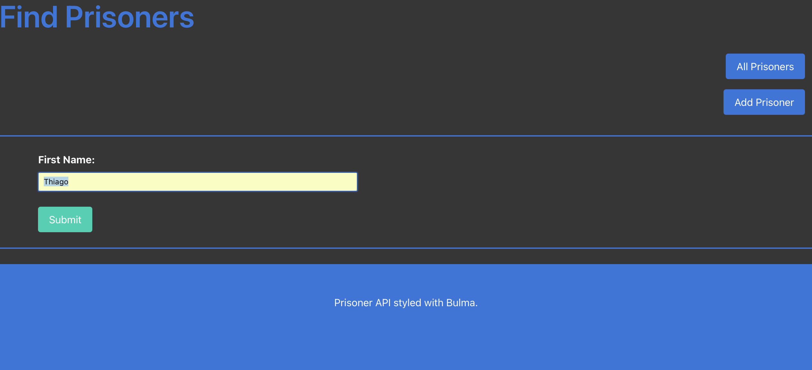
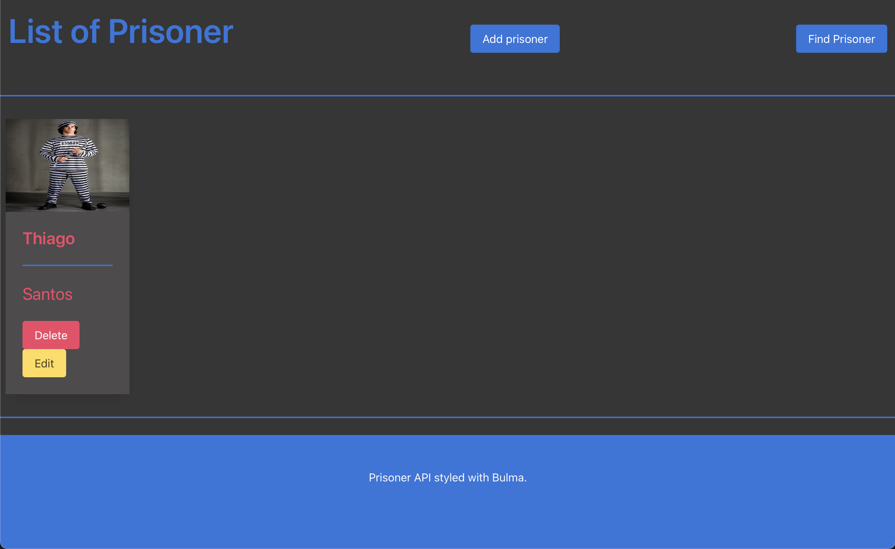
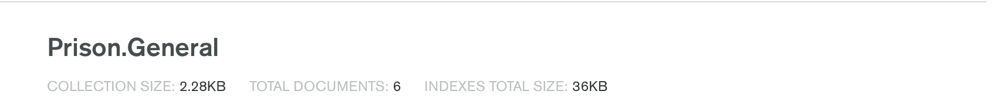
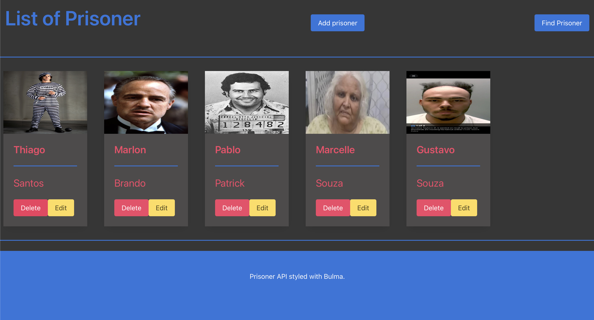

# College Portal - Thiago Santos
## BackEnd CA2 - Assignment 
#### Dorset College
## What is this?

Web Application to manage prison plant that you have access to data of every single one how are currently on the cells you can also transfer to another cell or/and section of the prison as you wish using a simple user interface you can easilly find and add new prisoner also release as you need.

## Walkthrough:

*Node.js Setup:https://nodejs.org/en/docs/guides/

*MongoDb Setup:https://www.mongodb.com

Installation Visual Studio.

### $ npm install mongodb --save
### $ cd Prison
### $ npm run dev

*Postman Setup:https://www.postman.com

*Express Setup:https://expressjs.com

Installation Visual Studio.

### $ npm install express --save

*Nodemon Setup:https://nodemon.io

Installation Visual Studio.

### $ npm install -g nodemon

On Mac you should use as administrator 

### $ sudo npm install -g nodemon

## About the Project

The main base of this project is the interaction the front end (Client using localhost port 3000 and server using port 8080 using four functions(GET, POST, PUT and DELETE) can reach 100% of the functionality of this application.

On the terminal you need to run the application using npm run dev after you initiate the browser going to open straight away on the main page that show all the prisoners.

### All Prisoners

Each one of the cards going to have all the informations linked from the database. 

### Edit Prisoners

If you click on edit button going to open the page with all the prisoner informations you can change this is going to change instantilly on the database.

On the top we have a navigation bar that if you dont change you can go to differentes pages or also press the change button as well.

### Add Prisoners

In this page you going to add a new prisoner just add the information and press the button Submit going to add straght to the database.

### Search Prisoners

Using the search you can locate all the user by the name but is simple to implement a diferent way to locate the user. 

### Search Prisoners

As you can see bellow as soon you hit the button to submit going to return all the prisoner that you wish.

### Research answer

Using the same page of the all user to be as simple as possible.

### Database

As you can notice that in the database has 6 inputs as you can see.

### Delete Prisoners

So after delete now has just 5 Prisoners on the List.

### Database after delete

#### Contributors

* [GeorgeBlanaru](https://github.com/georgeBl)

### License
Copyright 2020 - Thiago Dias Dos Santos
